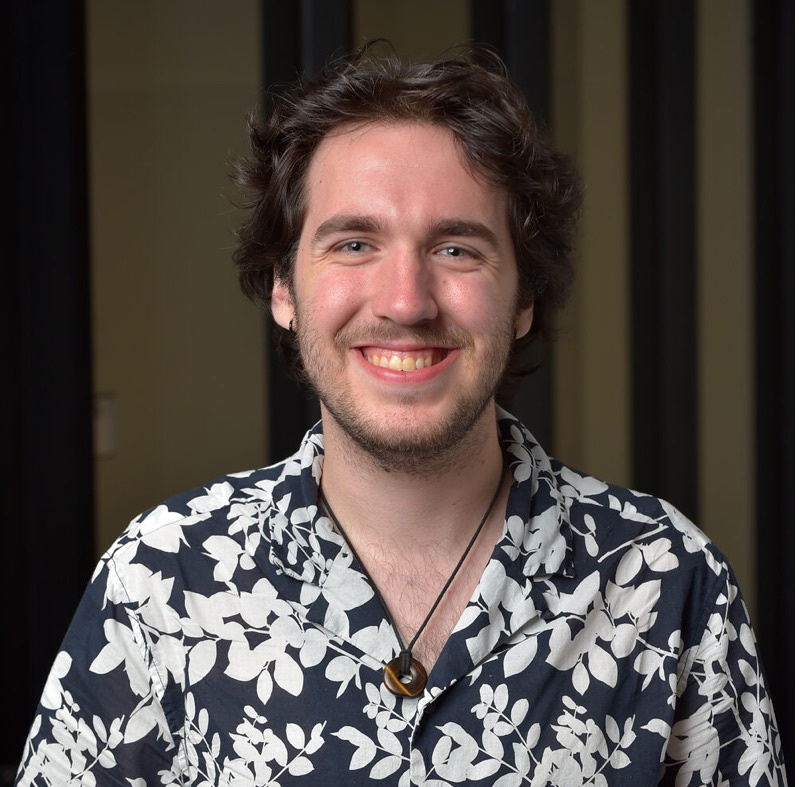

# About Me

Hey hey! I'm Ed!

I've lived in Illinois my entire life, and I am ecstatic to continue here for my PhD!

I am a third-year grad worker in the Physics & Astronomy department. 

Within NUGW, I have been a local steward for my home department as well as a Weinberg STEM Divisional Chief Steward.

In my free time, I love to play video games, watch movies, read fantasy, and hang out with my partner and our friends. 
I'm also currently trying to learn the ocarina!

I am always available to reach via email at [edward.skrabacz@u.northwestern.edu](edward.skrabacz@u.northwestern.edu) Give me a message if you want to chat!

Also, please take a moment to check out my candidate statement to learn more about my goals as President of NUGW!
