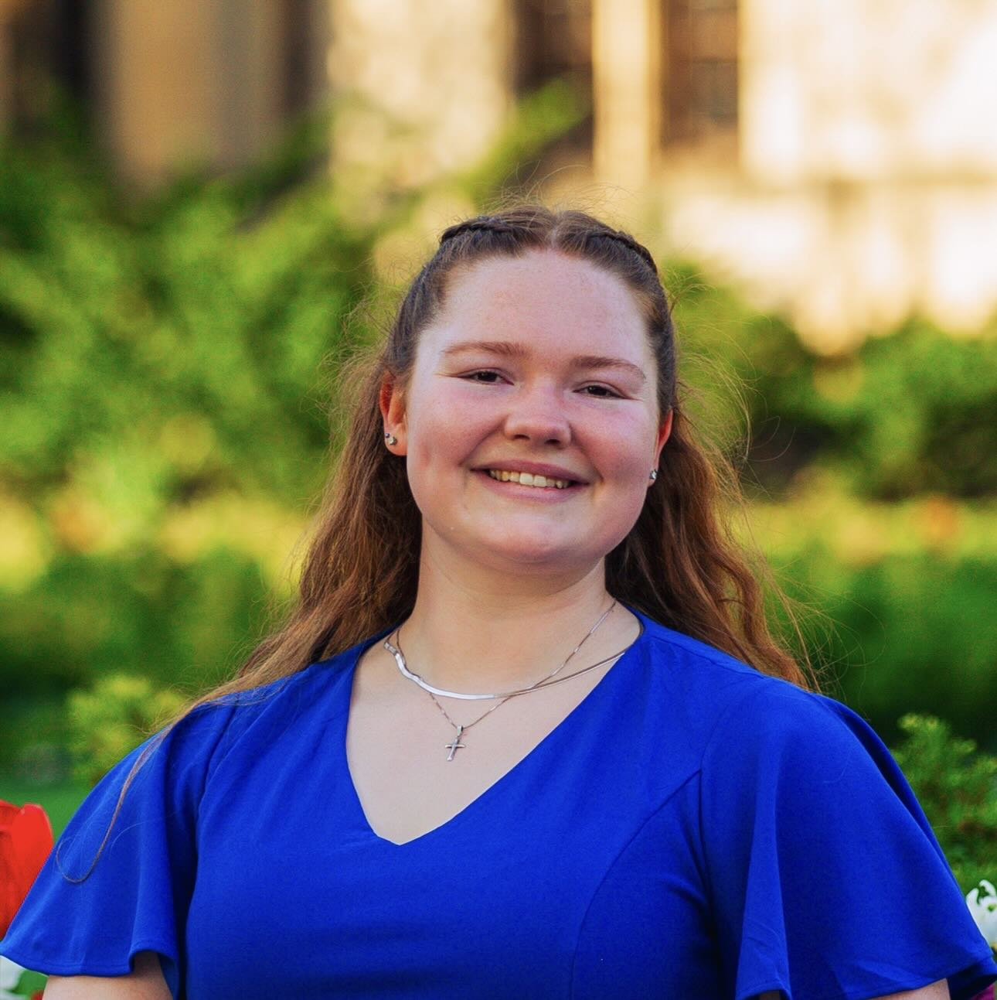

# About Me

Hi my name is Katherine Ellis!

I am a second year PhD student in chemical and biological engineering in the King group. I grew up in Missouri and did my undergrad at the University of Michigan. 

This past year I was a McCormick DCS and a ChBE local steward and I am passionate about helping my collegues have a better and safeer workplace which is why I am running for CCS!

Please feel free to email me at [katell@u.northwestern.edu](katell@u.northwestern.edu)

Please take a moment to check out my candidate statement and the other talking points and information on this site. 
