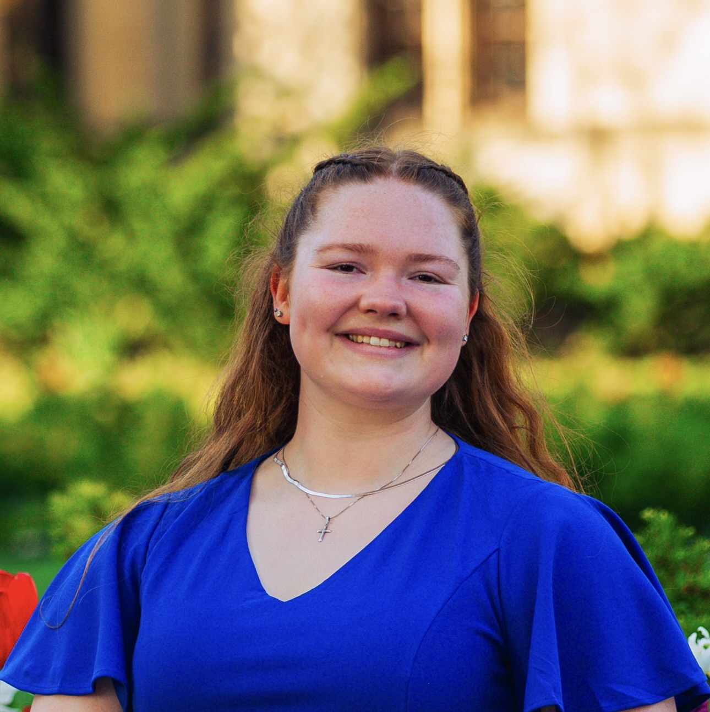

# About Me

Hi my name is Katherine Ellis!

I am a second year PhD student in chemical and biological engineering in the King group. 

I grew up in Missouri and did my undergrad at the University of Michigan. I got my bachelors in Chaimical Engineering with minors in Music and Math!

This past year I was a McCormick DCS and a ChBE local steward and I am passionate about helping my colleagues have a better and safer workplace which is why I am running for CCS!

Outside fo NUGW and my work I enjoy reading, drawing, the outdoors, and hanging out with friends! I'm also a musician and play french horn, trumpet, and I'm trying to learn guitar!

Please feel free to email me at [katell@u.northwestern.edu](katell@u.northwestern.edu)

Also please take a moment to check out my candidate statement to learn more about my vision as Campus Chief Steward!
