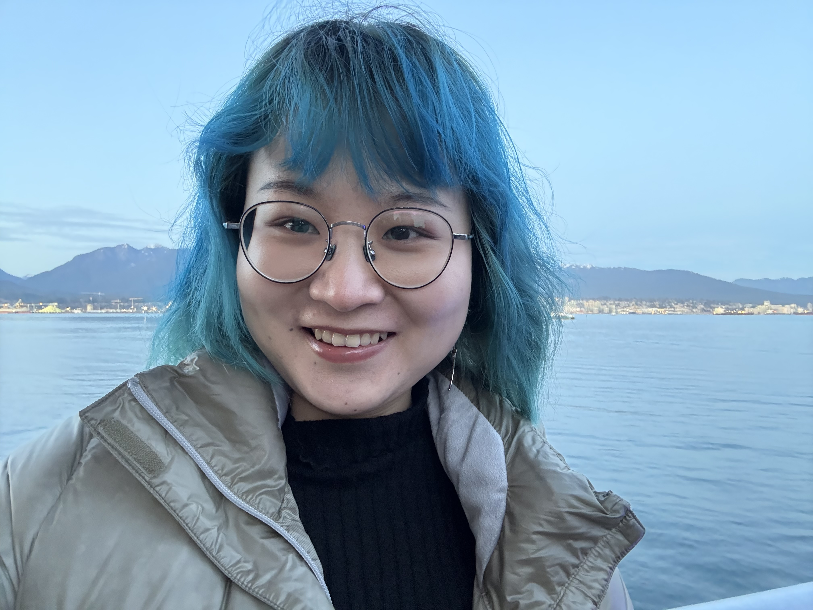

# About Me

Hi everyone! I’m so excited to meet you here virtually!

My name is Yuhan Zhang, and I’m a third-year PhD student in Communication Sciences and Disorders. I’m an international student from China, and this is also my third year living in Chicago.

I’ve always loved living in different places and meeting people from different cultural backgrounds. I speak Chinese, English, and Spanish. I’m constantly signing up for more languages on Duolingo while hoping I can actually keep the streak going!

I’m proud to be an international worker, and I care deeply about helping create a union environment where everyone feels safe, respected, and heard. I believe that when we stand together and actively participate, we can make our community stronger (and more fun!!).

Feel free to email me at [YuhanZhang2029@u.northwestern.edu](mailto:YuhanZhang2029@u.northwestern.edu).

I also invite you to read my candidate statement, which I wrote with a lot of care and thought about what I hope to contribute.

The town hall for the 2026–27 NUGW Executive Board and Trustee elections will be held this Wednesday at TGS Commons. I’d love to meet you in person, hear what matters to you, and answer any questions you have for me.

Let’s meet and chat!
