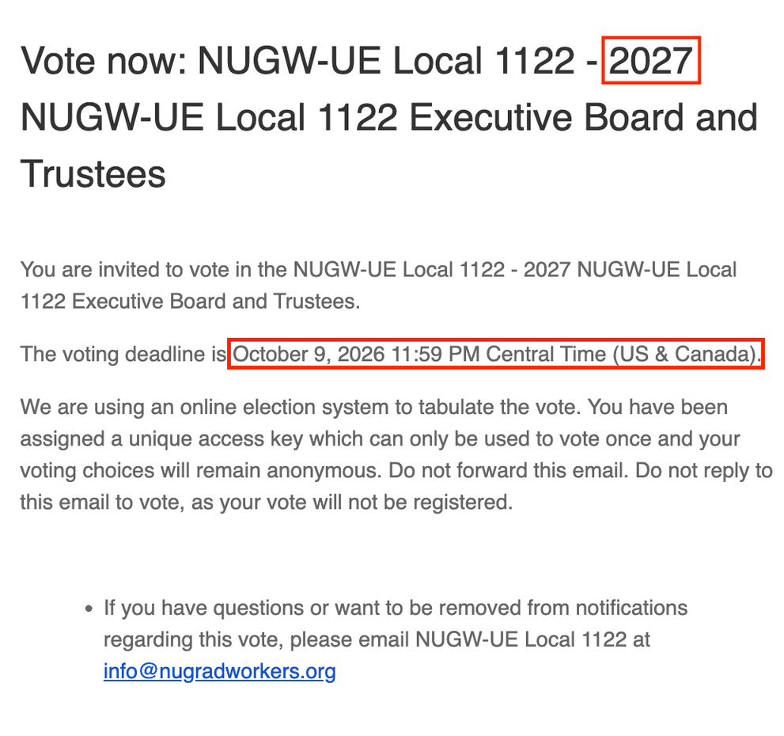

# How Do I Vote?
1. Go into the inboxes of **all** email addresses at which you have received mail from NUGW.

2. Look for an email with the subject line **“Vote now: NUGW-UE Local 1122 - 2027 NUGW-UE Local 1122 Executive Board and Trustees”** 
that was sent to one of your inboxes. The email will be sent from invitations@mail.electionbuddy.com 
(ElectionBuddy is a platform NUGW uses to run secure elections). The email body will begin as the following:

 * **Make sure that you’re looking at an email that says the ballot is for the 2027 Board+Trustees and that the voting deadline is Oct 9 2026 11:59 PM (outlined in red above)!**
   
 * _What’s the timestamp you should look for for your ballot email?_
   
   - For the vast majority of people, Monday Oct 5 at ~9:00 AM. If you signed up to be a member after that time, a rolling ballot is probably getting issued to you on Wednesday.
   
 * _Why check all of your inboxes for an email that was sent to one of your inboxes?_
   
   - NUGW emails are usually sent to all of the email addresses members provided and have not opted-out of receiving NUGW-sent emails from.
However, to ensure each member gets one vote, your Election Committee sent an email containing your unique ballot to just one of your email addresses on file (the one that’s marked on their end as your “primary email address”).
If you’d like to know what email address is listed as your primary email address, ask your Local Steward or email [recording.secretary@nugradworkers.org](mailto:recording.secretary@nugradworkers.org).

 * _If you can’t find the email containing your ballot:_
   
   -**Check your trash/junk/spam folders! Some members like you found it there.**
   - If you **still** can’t find it:
     +Email [recording.secretary@nugradworkers.org](mailto:recording.secretary@nugradworkers.org) to let the Election Committee know so that they send you a fresh ballot in their next wave of rolling ballots!
     Reminder that **only NUGW-UE Local 1122 members are allowed to vote**, so if you haven’t already signed up to be a member, be sure to do so before reaching out to the EC! You can sign up to be a member here: [https://nugwunion.org/sign-a-member-card/](https://nugwunion.org/sign-a-member-card/)
     +**You MUST sign up to be a member by THIS Friday at 9 AM in order to receive your ballot!**

3. Scroll further into the email for the **UNIQUE** ballot link made for you through ElectionBuddy; click on that link to open your virtual ballot and vote! :)

## PSA: Don’t share your ElectionBuddy link with other members!

The Election Committee set it up so that every member gets a personalized unique link in order to ensure a fair election where each member has one vote. If you have a NU grad worker friend that wants to be a part of the democratic process, it’s best to help them find _their_ link in _their_ inbox. :)     
